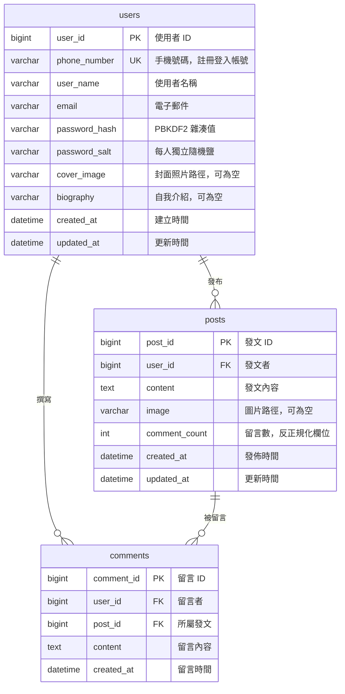

# DB — 資料庫設計與 Stored Procedure 說明

本資料夾存放規格要求的全部 DDL 與 DML。所有檔案會掛載至 MySQL 容器的
`/docker-entrypoint-initdb.d/`，容器**首次啟動時依檔名順序自動執行**，因此不需要任何手動匯入步驟。

| 檔案 | 類型 | 內容 |
| --- | --- | --- |
| `01_DDL_schema.sql` | DDL | 資料庫、三張資料表、索引、外鍵，以及應用程式帳號的最小權限設定 |
| `02_DDL_stored_procedures.sql` | DDL | 全部 14 支 Stored Procedure |
| `03_DML_seed_data.sql` | DML | 三位示範使用者、四篇發文、四則留言 |

> 重新初始化：`docker compose down -v` 清掉 `db-data` volume 後再 `docker compose up`。
> 只要 volume 還在，MySQL 就不會重跑這些腳本。

字元集統一 `utf8mb4` / `utf8mb4_unicode_ci`，正確支援中文與 emoji；儲存引擎一律 InnoDB（外鍵與 Transaction 的前提）。

---

## 1. ER 圖



---

## 2. 資料表

### `users`

| 欄位 | 型別 | 約束 | 說明 |
| --- | --- | --- | --- |
| `user_id` | `BIGINT` | PK, AUTO_INCREMENT | 使用者 ID |
| `phone_number` | `VARCHAR(20)` | NOT NULL, UNIQUE | 手機號碼，格式 `09XXXXXXXX` |
| `user_name` | `VARCHAR(50)` | NOT NULL | 使用者名稱 |
| `email` | `VARCHAR(255)` | NULL | 電子郵件 |
| `password_hash` | `VARCHAR(255)` | NOT NULL | PBKDF2 雜湊值（Base64） |
| `password_salt` | `VARCHAR(64)` | NOT NULL | 32-byte 隨機鹽（Base64） |
| `cover_image` | `VARCHAR(500)` | NULL | 封面照片相對路徑 |
| `biography` | `VARCHAR(500)` | NULL | 自我介紹 |
| `created_at` | `DATETIME` | NOT NULL, 預設現在時間 | 建立時間 |
| `updated_at` | `DATETIME` | NOT NULL, 更新時自動異動 | 更新時間 |

### `posts`

| 欄位 | 型別 | 約束 | 說明 |
| --- | --- | --- | --- |
| `post_id` | `BIGINT` | PK, AUTO_INCREMENT | 發文 ID |
| `user_id` | `BIGINT` | NOT NULL, FK → `users` | 發文者 |
| `content` | `TEXT` | NOT NULL | 發文內容 |
| `image` | `VARCHAR(500)` | NULL | 圖片相對路徑 |
| `comment_count` | `INT` | NOT NULL, 預設 0 | 留言數（反正規化） |
| `created_at` | `DATETIME` | NOT NULL, 預設現在時間 | 發佈時間 |
| `updated_at` | `DATETIME` | NOT NULL, 更新時自動異動 | 更新時間 |

索引：`idx_posts_created_at (created_at DESC)` 供時間軸排序、`idx_posts_user_id (user_id)` 供個人頁查詢。

### `comments`

| 欄位 | 型別 | 約束 | 說明 |
| --- | --- | --- | --- |
| `comment_id` | `BIGINT` | PK, AUTO_INCREMENT | 留言 ID |
| `user_id` | `BIGINT` | NOT NULL, FK → `users` | 留言者 |
| `post_id` | `BIGINT` | NOT NULL, FK → `posts` | 所屬發文 |
| `content` | `TEXT` | NOT NULL | 留言內容 |
| `created_at` | `DATETIME` | NOT NULL, 預設現在時間 | 留言時間 |

索引：`idx_comments_post_created (post_id, created_at)` 供單篇發文的留言分頁、`idx_comments_user_id (user_id)` 供外鍵檢查。

### 三個「規格欄位清單之外」的欄位

規格寫明「請包含，但不限制僅能有以下欄位」，以下三個為必要補充：

| 欄位 | 資料表 | 理由 |
| --- | --- | --- |
| `phone_number` | `users` | 規格要求「以手機號碼進行註冊與登入」，但欄位清單未列出。設 UNIQUE 確保帳號唯一。 |
| `password_salt` | `users` | 規格要求密碼「加鹽並經雜湊後儲存」。獨立欄位使加鹽機制在 Schema 層面即可稽核，不需翻閱程式碼。 |
| `comment_count` | `posts` | 列表頁需顯示留言數，即時 `COUNT(*)` 會在 N 篇發文上產生 N 次額外查詢。此欄位同時使「新增/刪除留言」成為真實的跨資料表異動情境，對應規格的 Transaction 要求。 |

另補 `created_at` / `updated_at` 稽核欄位。

### 外鍵刪除行為

`comments` 對 `posts` 的外鍵刻意**不使用** `ON DELETE CASCADE`，而是 `RESTRICT`。
留言的清除由 `sp_post_delete` 在明確的 Transaction 中處理，使規格要求的跨資料表異動在 SQL 中可見、可測試，而非隱藏在資料庫的隱含行為裡。

---

## 3. Stored Procedure

規格要求「所有資料庫存取一律透過 Stored Procedure」。以下 14 支涵蓋全部資料存取路徑，
應用程式不組裝任何 SQL 字串。

### 使用者

| Stored Procedure | 參數 | 回傳 |
| --- | --- | --- |
| `sp_user_register` | `IN p_phone_number, p_user_name, p_email, p_password_hash, p_password_salt`<br>`OUT p_user_id BIGINT` | OUT 新使用者 ID |
| `sp_user_find_by_phone` | `IN p_phone_number` | 結果集：使用者全欄位（**含** `password_hash` / `password_salt`） |
| `sp_user_find_by_id` | `IN p_user_id` | 結果集：使用者欄位（**不含**密碼雜湊與鹽） |
| `sp_user_update_profile` | `IN p_user_id, p_user_name, p_email, p_biography, p_cover_image`<br>`OUT p_affected_rows INT` | OUT 影響筆數 |

`sp_user_find_by_id` 刻意不回傳密碼欄位——個人檔案的讀取路徑無需接觸憑證資料，
可減少敏感欄位在應用層流通的機會。

`sp_user_update_profile` 採**全欄位取代**語意（對應 HTTP `PUT`）：傳入 `NULL` 即為清空該欄位，
呼叫端必須送出完整的檔案狀態。

### 發文

| Stored Procedure | 參數 | 回傳 |
| --- | --- | --- |
| `sp_post_create` | `IN p_user_id, p_content, p_image`<br>`OUT p_post_id BIGINT` | OUT 新發文 ID |
| `sp_post_list` | `IN p_limit, p_offset` | 結果集：發文 + 作者資訊，`created_at DESC` |
| `sp_post_count` | `OUT p_total BIGINT` | OUT 發文總數 |
| `sp_post_find_by_id` | `IN p_post_id` | 結果集：單篇發文 + 作者資訊 |
| `sp_post_update` | `IN p_post_id, p_user_id, p_content, p_image`<br>`OUT p_affected_rows INT` | OUT 影響筆數 |
| `sp_post_delete` | `IN p_post_id, p_user_id`<br>`OUT p_affected_rows INT` | OUT 影響筆數 |

`sp_post_list` / `sp_post_find_by_id` 以 `INNER JOIN users` 一次帶出作者資訊，避免列表頁的 N+1 查詢，
額外欄位為 `author_name`、`author_cover_image`。

### 留言

| Stored Procedure | 參數 | 回傳 |
| --- | --- | --- |
| `sp_comment_create` | `IN p_post_id, p_user_id, p_content`<br>`OUT p_comment_id BIGINT` | OUT 新留言 ID |
| `sp_comment_list_by_post` | `IN p_post_id, p_limit, p_offset` | 結果集：留言 + 留言者資訊，`created_at ASC` |
| `sp_comment_count_by_post` | `IN p_post_id`<br>`OUT p_total BIGINT` | OUT 留言總數 |
| `sp_comment_delete` | `IN p_comment_id, p_user_id`<br>`OUT p_affected_rows INT` | OUT 影響筆數 |

`sp_comment_count_by_post` 直接數 `comments` 而非讀 `posts.comment_count`：
分頁計算需要權威值，同時可作為反正規化欄位是否失準的對照。

### 共通約定

- **命名**：`sp_<資源>_<動作>`；參數前綴 `p_`、區域變數前綴 `v_`，杜絕與欄位同名造成的隱含遮蔽。
- **OUT 參數**：新建 ID 與影響筆數一律以 `OUT` 回傳，呼叫端不需解析結果集。
- **權限雙重把關**：編輯 / 刪除類 SP 的 `WHERE` 一律附帶 `AND user_id = p_user_id`。
  即使業務層的擁有者檢查被繞過，資料庫仍拒絕越權異動。
- **分頁夾限**：`p_limit` 於 SP 內夾限為 1..100、`p_offset` 不得為負，避免呼叫端誤傳造成全表掃描。
- **無動態 SQL**：全檔不出現 `PREPARE` / `EXECUTE`。

### 錯誤契約

應用層依此對應 HTTP 狀態碼：

| 資料庫端表現 | 情境 | 對應狀態碼 |
| --- | --- | --- |
| `SQLSTATE 45000` / `errno 1644`，`MESSAGE_TEXT = 'PHONE_ALREADY_REGISTERED'` | 手機號碼已被註冊 | `409 Conflict` |
| `ERROR 1062`（`uk_users_phone_number` 重複） | 同上，併發註冊時由唯一鍵攔下 | `409 Conflict` |
| `ERROR 1452`（外鍵約束失敗） | 對不存在的發文留言 | `404 Not Found` |
| `OUT p_affected_rows = 0` | 目標不存在，或不屬於此使用者 | `404` / `403`（由業務層區分） |

---

## 4. Transaction 設計

三支 SP 涉及多資料表異動，需保證原子性：

| Stored Procedure | 涉及資料表 | 不使用 Transaction 的後果 |
| --- | --- | --- |
| `sp_post_delete` | `comments` → `posts` | 留言已刪但發文刪除失敗，產生孤兒留言 |
| `sp_comment_create` | `comments` → `posts` | 留言已寫入但計數未更新，顯示的留言數與實際不符 |
| `sp_comment_delete` | `comments` → `posts` | 同上，計數虛高 |

實作樣式：

```sql
DECLARE EXIT HANDLER FOR SQLEXCEPTION
BEGIN
    ROLLBACK;
    RESIGNAL;
END;

START TRANSACTION;
    DELETE FROM comments WHERE post_id = p_post_id;
    DELETE FROM posts    WHERE post_id = p_post_id AND user_id = p_user_id;
COMMIT;
```

`EXIT HANDLER` 確保任一語句失敗時整筆回滾，`RESIGNAL` 將原始錯誤往上拋，
讓應用層取得真實錯誤原因而非靜默失敗。

**`sp_post_delete` 的越權情境也走回滾**：非本人刪除時 `posts` 的 `ROW_COUNT()` 為 0，
此時整筆交易 `ROLLBACK`，連同已刪除的留言一併還原——「刪別人的發文」不會留下任何副作用。
這條路徑是 Transaction 回滾最直接的驗證點。

業務層另以 `@Transactional` 界定跨多次 SP 呼叫的邊界。兩層並存不衝突：
SP 內的 Transaction 保證單次呼叫的原子性，`@Transactional` 保證跨呼叫的原子性。

### 兩個容易忽略的細節

- **`updated_at = updated_at`**：`posts.updated_at` 設有 `ON UPDATE CURRENT_TIMESTAMP`。
  遞增 / 遞減 `comment_count` 時若不明確賦值，留言會意外更動發文的「編輯時間」。
- **`GREATEST(comment_count - 1, 0)`**：保證計數不會因任何意外情形變成負數。

---

## 5. 密碼儲存契約

規格要求密碼「加鹽並經雜湊後儲存」。演算法與編碼方式固定如下，**應用層的實作必須與此一致**，
否則 `03_DML_seed_data.sql` 的示範帳號將無法登入：

| 項目 | 值 |
| --- | --- |
| 演算法 | `PBKDF2WithHmacSHA256` |
| 疊代次數 | `310000` |
| 導出金鑰長度 | `256` bits |
| 鹽 | 每位使用者獨立的 **32 bytes** `SecureRandom` 亂數 |
| `password_salt` 儲存格式 | 鹽的 Base64 編碼（44 字元） |
| `password_hash` 儲存格式 | 導出金鑰的 Base64 編碼（44 字元） |

```
password_hash = Base64( PBKDF2WithHmacSHA256( password,
                                              Base64Decode(password_salt),
                                              310000,
                                              256 bits ) )
```

驗證時以資料庫取回的 `password_salt` 重算並以**定時比較**（constant-time）比對雜湊，
避免以字串相等比較洩漏時間資訊。

---

## 6. 權限模型 — SQL Injection 的最後一道防線

MySQL 容器的 entrypoint 會依 `MYSQL_USER` / `MYSQL_PASSWORD` 建立應用程式帳號，
並預設授予該資料庫的**全部權限**。`01_DDL_schema.sql` 收回全部權限，只留下 Stored Procedure 的 `EXECUTE`：

```sql
GRANT EXECUTE ON `message\_me`.* TO 'app_user'@'%';
REVOKE ALL PRIVILEGES ON `message\_me`.* FROM 'app_user'@'%';
GRANT EXECUTE ON `message\_me`.* TO 'app_user'@'%';
```

兩個容易踩的細節：

- **先 `GRANT` 一次**，是為了讓腳本在全新帳號上也能執行——對沒有任何授權紀錄的帳號下
  `REVOKE` 會以 `ERROR 1141` 中斷。
- **資料庫名稱必須跳脫成 `` `message\_me` ``**。在 `GRANT` / `REVOKE` 的資料庫名稱中，
  未跳脫的 `_` 是「比對任一字元」的萬用字元，因此 `message_me` 與 `message\_me`
  被 MySQL 視為**兩筆不同的授權紀錄**。容器 entrypoint 授予的是跳脫形式，
  若以未跳脫形式 `REVOKE`，只會多建一筆萬用字元授權，entrypoint 的 `ALL PRIVILEGES`
  原封不動地留著——最小權限形同虛設，而且 `SHOW GRANTS` 之外看不出異狀。

Stored Procedure 宣告為 `SQL SECURITY DEFINER`，以建立者（`root`）的權限執行，
因此 `app_user` 僅憑 `EXECUTE` 即可完成全部功能，**不需要任何資料表權限**。
資料存取路徑被限縮為「僅這 14 支已審查過的程序」。

審核者可直接驗證：

```bash
docker compose exec db mysql -u app_user -p -e "SELECT * FROM message_me.users;"
# 預期：ERROR 1142 (42000): SELECT command denied to user 'app_user'@'...' for table 'users'
```

> 帳號名稱寫死為 `app_user`。若要改用其他名稱，需同步修改 `.env` 的 `MYSQL_USER`
> 與 `01_DDL_schema.sql` 末段的授權語句。

這是四道 SQL Injection 防線的第四道，前三道在應用層與 SP 內：

1. 全面使用 Stored Procedure，應用程式不組裝任何 SQL 字串
2. `SimpleJdbcCall` 以 `CallableStatement` 綁定參數，輸入值永遠是資料而非語法
3. SP 內無動態 SQL（無 `PREPARE` / `EXECUTE`）
4. 最小權限資料庫帳號（本節）

連線字串另設 `allowMultiQueries=false`，禁止單次請求挾帶多段語句。

---

## 7. 示範資料

`03_DML_seed_data.sql` 建立三位使用者、四篇發文、四則留言，**密碼皆為 `Test1234!`**：

| 手機號碼（登入帳號） | 使用者名稱 | 密碼 |
| --- | --- | --- |
| `0912345678` | 王小明 | `Test1234!` |
| `0922333444` | 陳美玲 | `Test1234!` |
| `0933555666` | 林大衛 | `Test1234!` |

其中的 `password_hash` / `password_salt` 是實際以第 5 節的參數算出的真值，並非佔位字串，
可直接用於登入驗證。全部語句使用 `INSERT IGNORE` 搭配明確主鍵，重複執行為 no-op。

> ⚠ 這是評測用的示範資料，正式環境請勿載入。

---

## 8. 給後續開發與測試的注意事項

- **`DELIMITER` 是 `mysql` 客戶端指令**，不是伺服器語法。
  Testcontainers 請以 `withCopyFileToContainer` 把本資料夾的 `.sql` 放進
  `/docker-entrypoint-initdb.d/`，交由容器的 `mysql` 客戶端執行；
  **不要用 `withInitScript`**——它在 Java 端切分語句，無法處理 `DELIMITER`。
- **Connector/J 的程序中繼資料**：`CallableStatement` 預設會讀取程序定義以推導參數型別。
  `app_user` 只有 `EXECUTE` 權限，若出現
  `User does not have access to metadata required to determine stored procedure parameter types`，
  於 JDBC URL 加上 `noAccessToProcedureBodies=true`，或在 `SimpleJdbcCall` 上
  改用 `withoutProcedureColumnMetaDataAccess()` 並明確宣告參數。
- **新增或修改 SP 後**，`02_DDL_stored_procedures.sql` 的每支程序前都有
  `DROP PROCEDURE IF EXISTS`，可對既有資料庫直接重跑本檔更新定義，不影響資料。
