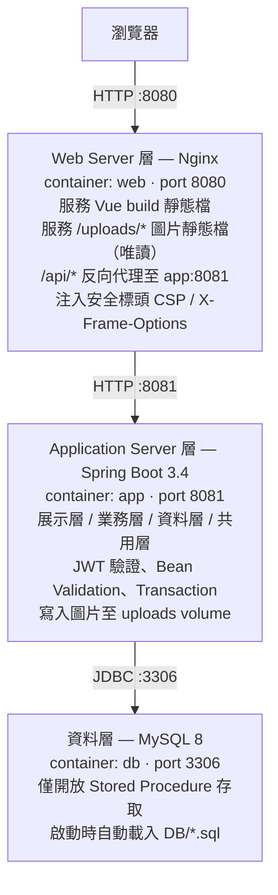
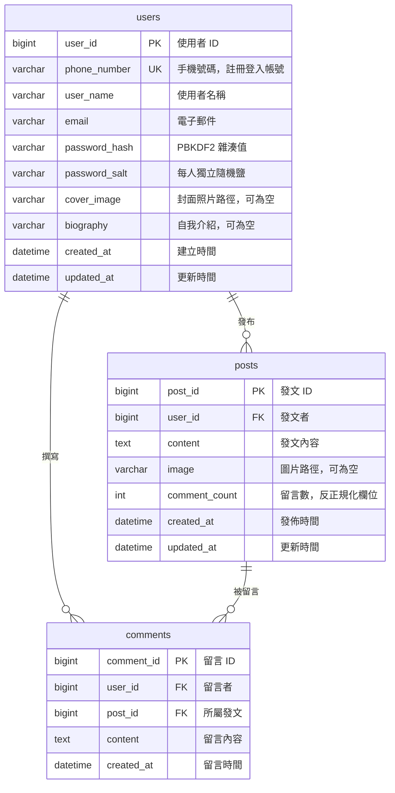

# 設計文件 — 簡易社群媒體平台

本文件說明系統的架構決策、資料庫設計、API 規格與安全性措施，作為實作依據與審核參考。
需求規格見 [`original_spec.md`](../original_spec.md)。

---

## 1. 專案概觀

實作一個簡易社群媒體平台，使用者以**手機號碼**註冊與登入，登入後可發文、編輯與刪除自己的發文，並對任何發文留言。系統採 **Web Server + Application Server + 關聯式資料庫**的三層式架構，所有資料庫存取一律透過 **Stored Procedure**。

### 核心功能

| 功能 | 說明 |
| --- | --- |
| 註冊 | 以手機號碼為唯一帳號識別，密碼加鹽雜湊後儲存 |
| 登入驗證 | 簽發 JWT，未持有效 token 者無法發文或留言 |
| 發文 | 新增、列出全部（分頁）、編輯、刪除；編輯與刪除僅限本人 |
| 留言 | 針對發文新增留言、列出留言、刪除自己的留言 |
| 個人檔案 | 維護使用者名稱、Email、自我介紹、封面照片 |
| 圖片上傳 | 發文圖片與個人封面照，含檔案類型與大小驗證 |

---

## 2. 需求對照表

供審核者快速核對規格條目與實作位置。

| 規格要求 | 實作方式 | 對應章節 |
| --- | --- | --- |
| 註冊功能（手機號碼） | `POST /api/auth/register`，`users.phone_number` 設 UNIQUE 約束 | [§6](#6-api-設計) |
| 登入驗證功能 | Spring Security 6 + JWT，寫入操作端點全數需要驗證 | [§7.1](#71-身份驗證與授權) |
| 發文功能（新增/列出/編輯/刪除） | `POST` / `GET` / `PUT` / `DELETE /api/posts` | [§6](#6-api-設計) |
| 留言功能 | `POST` / `GET /api/posts/{postId}/comments` | [§6](#6-api-設計) |
| Web + App + RDBMS 三層架構 | Nginx / Spring Boot / MySQL 8，三個獨立容器 | [§3](#3-系統架構) |
| 展示層、業務層、資料層、共用層 | `presentation` / `business` / `data` / `common` 四個頂層套件 | [§4](#4-後端分層設計) |
| Vue.js 前端 | Vue 3 + Vite + TypeScript + Pinia + Naive UI | [§8](#8-前端設計) |
| Spring Boot 應用程式 | Spring Boot 3.4 / Java 21 | [§3](#3-系統架構) |
| RESTful API | 資源導向路徑、HTTP 動詞語意、標準狀態碼 | [§6](#6-api-設計) |
| Maven 或 Gradle | Maven，附 Maven Wrapper（`mvnw`） | [§3.3](#33-建置與執行) |
| 透過 Stored Procedure 存取資料庫 | 全部經 SP；應用程式 DB 帳號僅授予 `EXECUTE` 權限 | [§5.3](#53-stored-procedure-清單) |
| 多表異動實作 Transaction | 3 支 SP 內含 Transaction，Service 層另以 `@Transactional` 界定邊界 | [§5.4](#54-transaction-設計) |
| DDL 與 DML 存放於 `\DB` | `DB/01_DDL_schema.sql`、`02_DDL_stored_procedures.sql`、`03_DML_seed_data.sql` | [§5](#5-資料庫設計) |
| 防止 SQL Injection | SP + 參數綁定 + 無動態 SQL + 最小權限 DB 帳號 | [§7.2](#72-sql-injection-防護) |
| 防止 XSS | 輸入清洗 + 輸出自動轉義 + 禁用 `v-html` + CSP 標頭 | [§7.3](#73-xss-防護) |
| 密碼加鹽雜湊 | 獨立 `password_salt` 欄位 + PBKDF2-HMAC-SHA256 | [§7.4](#74-密碼儲存) |
| User / Post / Comment 資料表 | 規格欄位全數實作，另補必要欄位（見 §5.2 說明） | [§5.2](#52-資料表定義) |

---

## 3. 系統架構

### 3.1 三層式部署架構



三層各自為獨立容器，透過 Docker Compose 的內部網路溝通。**僅 Nginx 對外暴露連接埠**，Spring Boot 與 MySQL 不對主機開放，符合三層式架構中「前端不直接接觸資料層」的意圖。

圖片以具名 volume `uploads` 共享：Spring Boot 以讀寫模式掛載並負責寫入，Nginx 以**唯讀**模式掛載並負責對外服務。上傳的檔案因此不會經過應用程式的執行路徑被讀出，即使其中混入非預期內容也無法被當作程式執行。

### 3.2 技術選型

| 層級 | 技術 | 選用理由 |
| --- | --- | --- |
| Web Server | Nginx 1.27-alpine | 靜態檔服務效能佳、反向代理設定簡潔、image 體積小 |
| Application Server | Spring Boot 3.4 / Java 21 LTS | Spring Boot 2.7 已於 2023 年終止支援，公開專案不宜採用已停止安全更新的版本 |
| 資料庫 | MySQL 8.4 | Stored Procedure 語法簡潔易讀，JDBC driver 成熟 |
| 資料存取 | Spring JDBC `SimpleJdbcCall` | 見下方說明 |
| 身份驗證 | Spring Security 6 + JWT (jjwt 0.12) | 無狀態驗證，與 RESTful 的無狀態特性一致 |
| 前端 | Vue 3 + TypeScript + Pinia + Naive UI | Naive UI 以 TypeScript 原生撰寫，型別推導完整；視覺風格適合社群動態牆 |
| 建置 | Maven + Maven Wrapper | Wrapper 讓審核者無須預先安裝 Maven |

**為何不用 JPA / Hibernate？**
規格要求所有資料庫存取透過 Stored Procedure，ORM 最主要的價值（自動產生 SQL、關聯映射、快取）在此完全無法發揮，卻要額外維護一套與資料表對應的 Entity。`SimpleJdbcCall` 是 Spring 原生的 SP 呼叫 API，以 `CallableStatement` 綁定參數，程式碼直接對應到 SP 簽章，審核時一眼即可看出每支 SP 如何被呼叫。

### 3.3 建置與執行

```bash
cp .env.example .env     # 填入 JWT_SECRET 等機密設定
docker compose up --build
# 開啟 http://localhost:8080
```

單獨開發時：後端 `cd backend && ./mvnw spring-boot:run`，前端 `cd frontend && npm run dev`。

---

## 4. 後端分層設計

規格要求區分展示層、業務層、資料層與共用層，對應為四個頂層套件：

```
com.esun.social
├── presentation/          【展示層】處理 HTTP，不含業務邏輯
│   ├── controller/        AuthController / UserController / PostController
│   │                      CommentController / FileController
│   └── dto/
│       ├── request/       輸入 DTO，套用 Bean Validation 標註
│       └── response/      輸出 DTO，不直接外洩領域模型
│
├── business/              【業務層】業務規則與授權判斷，不認識 HTTP
│   ├── service/           AuthService / UserService / PostService
│   │                      CommentService / FileStorageService
│   └── model/             User / Post / Comment 領域模型
│
├── data/                  【資料層】唯一與資料庫溝通的層級
│   ├── repository/        以 SimpleJdbcCall 呼叫 Stored Procedure
│   └── rowmapper/         ResultSet → 領域模型的映射
│
└── common/                【共用層】跨層共用的基礎設施
    ├── config/            SecurityConfig / JdbcConfig / WebConfig / OpenApiConfig
    ├── security/          JwtTokenProvider / JwtAuthenticationFilter / AuthenticatedUser
    ├── exception/         BusinessException / ErrorCode / GlobalExceptionHandler
    ├── util/              PasswordHasher / HtmlSanitizer
    └── response/          ApiResponse<T> / PageResponse<T>
```

### 依賴方向

```
presentation ──▶ business ──▶ data
      │              │           │
      └──────────────┴───────────┴──▶ common
```

規則為**單向依賴**，且不可逆向：

- 展示層只與業務層對話，不得直接注入 Repository。
- 業務層不得引用任何 `jakarta.servlet` 或 Spring Web 型別，確保業務規則可獨立測試。
- 資料層只回傳領域模型，不回傳 DTO。
- 共用層被所有層引用，但不反向依賴任何一層。

### 各層職責界線

| 層級 | 負責 | 不負責 |
| --- | --- | --- |
| 展示層 | 路由、參數驗證、DTO 轉換、HTTP 狀態碼 | 業務規則、權限判斷、資料庫 |
| 業務層 | 業務規則、授權判斷、Transaction 邊界、輸入清洗 | HTTP 細節、SQL |
| 資料層 | 呼叫 SP、參數綁定、ResultSet 映射 | 業務規則、權限判斷 |
| 共用層 | 設定、安全機制、例外處理、共用工具與回應格式 | 任何特定功能的業務邏輯 |

---

## 5. 資料庫設計

### 5.1 ER 圖



### 5.2 資料表定義

規格列出的欄位全數實作，另補三個欄位，理由如下：

| 補充欄位 | 所在資料表 | 理由 |
| --- | --- | --- |
| `phone_number` | `users` | 規格要求「以手機號碼進行註冊與登入」，但欄位清單未列出手機號碼。依規格「請包含，但不限制僅能有以下」補上，並設 UNIQUE 約束確保帳號唯一。 |
| `password_salt` | `users` | 規格要求密碼「加鹽並經雜湊後儲存」，獨立欄位使加鹽機制在 Schema 層面即可驗證。 |
| `comment_count` | `posts` | 反正規化的留言計數。列表頁需顯示留言數，若每次即時 `COUNT(*)` 會在 N 篇發文上產生 N 次額外查詢。此欄位同時使「新增/刪除留言」成為真實的跨資料表異動情境，對應規格的 Transaction 要求。 |

另補 `created_at` / `updated_at` 稽核欄位。

**`users`**

| 欄位 | 型別 | 約束 | 說明 |
| --- | --- | --- | --- |
| `user_id` | `BIGINT` | PK, AUTO_INCREMENT | 使用者 ID |
| `phone_number` | `VARCHAR(20)` | NOT NULL, UNIQUE | 手機號碼，格式 `09XXXXXXXX` |
| `user_name` | `VARCHAR(50)` | NOT NULL | 使用者名稱 |
| `email` | `VARCHAR(255)` | NULL | 電子郵件 |
| `password_hash` | `VARCHAR(255)` | NOT NULL | PBKDF2 雜湊值（Base64） |
| `password_salt` | `VARCHAR(64)` | NOT NULL | 32-byte 隨機鹽（Base64） |
| `cover_image` | `VARCHAR(500)` | NULL | 封面照片相對路徑 |
| `biography` | `VARCHAR(500)` | NULL | 自我介紹 |
| `created_at` | `DATETIME` | NOT NULL, 預設現在時間 | 建立時間 |
| `updated_at` | `DATETIME` | NOT NULL, 更新時自動異動 | 更新時間 |

**`posts`**

| 欄位 | 型別 | 約束 | 說明 |
| --- | --- | --- | --- |
| `post_id` | `BIGINT` | PK, AUTO_INCREMENT | 發文 ID |
| `user_id` | `BIGINT` | NOT NULL, FK → `users` | 發文者 |
| `content` | `TEXT` | NOT NULL | 發文內容 |
| `image` | `VARCHAR(500)` | NULL | 圖片相對路徑 |
| `comment_count` | `INT` | NOT NULL, 預設 0 | 留言數 |
| `created_at` | `DATETIME` | NOT NULL, 預設現在時間 | 發佈時間 |
| `updated_at` | `DATETIME` | NOT NULL, 更新時自動異動 | 更新時間 |

索引：`idx_posts_created_at (created_at DESC)` 供時間軸排序、`idx_posts_user_id (user_id)` 供個人頁查詢。

**`comments`**

| 欄位 | 型別 | 約束 | 說明 |
| --- | --- | --- | --- |
| `comment_id` | `BIGINT` | PK, AUTO_INCREMENT | 留言 ID |
| `user_id` | `BIGINT` | NOT NULL, FK → `users` | 留言者 |
| `post_id` | `BIGINT` | NOT NULL, FK → `posts` | 所屬發文 |
| `content` | `TEXT` | NOT NULL | 留言內容 |
| `created_at` | `DATETIME` | NOT NULL, 預設現在時間 | 留言時間 |

索引：`idx_comments_post_created (post_id, created_at)` 供單篇發文的留言分頁查詢。

字元集統一為 `utf8mb4` / `utf8mb4_unicode_ci`，以正確支援中文與 emoji。

### 5.3 Stored Procedure 清單

| Stored Procedure | 用途 | 含 Transaction |
| --- | --- | --- |
| `sp_user_register` | 註冊：檢查手機是否已存在，寫入使用者，回傳 `OUT` 新 ID | |
| `sp_user_find_by_phone` | 依手機號碼查詢（登入用，回傳雜湊與鹽） | |
| `sp_user_find_by_id` | 依 ID 查詢使用者 | |
| `sp_user_update_profile` | 更新名稱 / Email / 自我介紹 / 封面照片 | |
| `sp_post_create` | 新增發文，回傳 `OUT` 新 ID | |
| `sp_post_list` | 分頁列出全部發文，JOIN `users` 帶出作者資訊 | |
| `sp_post_count` | 回傳發文總數，供分頁計算 | |
| `sp_post_find_by_id` | 查詢單篇發文 | |
| `sp_post_update` | 編輯發文，比對 `user_id` 確保僅能改自己的 | |
| `sp_post_delete` | 刪除發文**與其全部留言** | ✅ |
| `sp_comment_create` | 新增留言**並遞增** `posts.comment_count` | ✅ |
| `sp_comment_list_by_post` | 分頁列出單篇發文的留言 | |
| `sp_comment_count_by_post` | 回傳單篇發文的留言總數 | |
| `sp_comment_delete` | 刪除留言**並遞減** `posts.comment_count` | ✅ |

**設計約定**

- 需回傳單一新建 ID 或影響筆數者，一律以 `OUT` 參數回傳，避免呼叫端解析結果集。
- 涉及權限的操作（編輯、刪除）在 SP 內以 `WHERE ... AND user_id = p_user_id` 二次把關，即使業務層的檢查被繞過，資料庫仍拒絕越權異動。
- **SP 內一律不使用動態 SQL**（不出現 `PREPARE` / `EXECUTE`），從根本消除注入路徑。

### 5.4 Transaction 設計

三支 SP 涉及多資料表異動，需保證原子性：

| 情境 | 涉及資料表 | 不使用 Transaction 的後果 |
| --- | --- | --- |
| 刪除發文 | `comments` → `posts` | 留言已刪但發文刪除失敗，產生孤兒留言 |
| 新增留言 | `comments` → `posts` | 留言已寫入但計數未更新，顯示的留言數與實際不符 |
| 刪除留言 | `comments` → `posts` | 同上，計數虛高 |

SP 內的實作樣式：

```sql
DECLARE EXIT HANDLER FOR SQLEXCEPTION
BEGIN
    ROLLBACK;
    RESIGNAL;
END;

START TRANSACTION;
    DELETE FROM comments WHERE post_id = p_post_id;
    DELETE FROM posts    WHERE post_id = p_post_id AND user_id = p_user_id;
COMMIT;
```

`EXIT HANDLER` 確保任一語句失敗時整筆回滾，`RESIGNAL` 將原始錯誤往上拋，讓應用層能取得真實錯誤原因而非靜默失敗。

業務層另以 `@Transactional` 界定跨多次 SP 呼叫的邊界（例如未來的「刪除帳號」需連續呼叫多支 SP）。兩層並存不衝突：SP 內的 Transaction 保證單次呼叫的原子性，`@Transactional` 保證跨呼叫的原子性。

### 5.5 DB 資料夾結構

規格要求 DDL 與 DML 存放於專案下的 `DB` 資料夾：

| 檔案 | 內容 |
| --- | --- |
| `DB/01_DDL_schema.sql` | 建立資料庫、資料表、索引、外鍵，以及應用程式專用帳號與權限授予 |
| `DB/02_DDL_stored_procedures.sql` | 全部 Stored Procedure 定義 |
| `DB/03_DML_seed_data.sql` | 範例使用者、發文與留言資料 |
| `DB/README.md` | 資料表與 SP 的說明文件 |

檔名的數字前綴用於控制執行順序。這三個檔案會掛載至 MySQL 容器的 `/docker-entrypoint-initdb.d/`，容器首次啟動時依序自動執行，因此**不需要任何手動匯入步驟**。

---

## 6. API 設計

採 RESTful 風格：路徑為名詞資源、以 HTTP 動詞表達操作、回傳標準狀態碼。

| 方法 | 路徑 | 驗證 | 說明 |
| --- | --- | :---: | --- |
| `POST` | `/api/auth/register` | | 註冊 |
| `POST` | `/api/auth/login` | | 登入，回傳 JWT |
| `GET` | `/api/users/me` | 🔒 | 取得自己的完整資料 |
| `PUT` | `/api/users/me` | 🔒 | 更新個人檔案 |
| `GET` | `/api/users/{userId}` | | 取得公開個人檔案 |
| `POST` | `/api/posts` | 🔒 | 新增發文 |
| `GET` | `/api/posts?page=&size=` | | 分頁列出全部發文 |
| `GET` | `/api/posts/{postId}` | | 取得單篇發文 |
| `PUT` | `/api/posts/{postId}` | 🔒 | 編輯發文（僅本人） |
| `DELETE` | `/api/posts/{postId}` | 🔒 | 刪除發文（僅本人） |
| `POST` | `/api/posts/{postId}/comments` | 🔒 | 新增留言 |
| `GET` | `/api/posts/{postId}/comments?page=&size=` | | 分頁列出留言 |
| `DELETE` | `/api/comments/{commentId}` | 🔒 | 刪除留言（僅本人） |
| `POST` | `/api/files/images` | 🔒 | 上傳圖片，回傳存取路徑 |

### 統一回應格式

成功：

```json
{ "success": true, "data": { "postId": 1, "content": "今天天氣很好" }, "error": null }
```

失敗：

```json
{ "success": false, "data": null,
  "error": { "code": "POST_NOT_FOUND", "message": "找不到指定的發文" } }
```

分頁資料以 `PageResponse<T>` 包裝，含 `items`、`page`、`size`、`totalElements`、`totalPages`。

### 狀態碼與錯誤處理

| 狀態碼 | 使用情境 |
| --- | --- |
| `200 OK` | 查詢、更新成功 |
| `201 Created` | 註冊、發文、留言、上傳成功 |
| `204 No Content` | 刪除成功 |
| `400 Bad Request` | 輸入驗證失敗 |
| `401 Unauthorized` | 未提供 token、token 無效或已過期 |
| `403 Forbidden` | 已登入但操作他人資源 |
| `404 Not Found` | 資源不存在 |
| `409 Conflict` | 手機號碼已被註冊 |
| `413 Payload Too Large` | 上傳檔案超過大小上限 |

所有例外集中由 `GlobalExceptionHandler` 轉換為統一格式。**對外一律不回傳 stack trace 或資料庫錯誤原文**，避免洩漏內部結構；完整錯誤記錄於伺服器日誌。

---

## 7. 安全設計

### 7.1 身份驗證與授權

- 登入成功後簽發 JWT（HS256），有效期 2 小時，payload 僅含 `userId`、`phoneNumber` 與過期時間，**不含任何敏感資料**。
- 簽章密鑰由環境變數 `JWT_SECRET` 注入，`.env` 已列入 `.gitignore`，**原始碼中不出現任何密鑰**。
- `JwtAuthenticationFilter` 攔截請求，驗證 `Authorization: Bearer <token>` 後填入 Spring Security 的 `SecurityContext`。
- 預設拒絕：`SecurityConfig` 以白名單方式僅開放註冊、登入與讀取類端點，其餘全部需要驗證。
- **授權採雙重檢查**：業務層比對登入者與資源擁有者，資料層的 SP 再以 `WHERE user_id = p_user_id` 把關。單層防護若因程式碼修改而失效，另一層仍能阻擋越權。

### 7.2 SQL Injection 防護

採**四道防線**，任一道失效仍有其他層級保護：

1. **全面使用 Stored Procedure** — 應用程式不組裝任何 SQL 字串。
2. **參數綁定** — `SimpleJdbcCall` 以 `CallableStatement` 傳遞參數，輸入值永遠被當作資料而非可執行語法。
3. **SP 內無動態 SQL** — 不使用 `PREPARE` / `EXECUTE`，杜絕注入在資料庫端被重新組裝的可能。
4. **最小權限資料庫帳號** — 應用程式帳號僅授予 SP 的 `EXECUTE` 權限，**不授予資料表的 SELECT / INSERT / UPDATE / DELETE**。即使前三道全部失效，該帳號在資料庫層面也無法對資料表下達任意 SQL。

連線字串明確設定 `allowMultiQueries=false`，禁止單次請求挾帶多段語句。

第 4 點可由審核者直接驗證：

```bash
docker compose exec db mysql -u app_user -p -e "SELECT * FROM users;"
# 預期結果：ERROR 1142 — SELECT command denied
```

### 7.3 XSS 防護

採**縱深防禦**，輸入、輸出、瀏覽器三個環節各有防線：

1. **輸入清洗** — 業務層以 Jsoup `Safelist.none()` 清洗 `content`、`biography`、`user_name`，移除全部 HTML 標籤後才寫入資料庫。
2. **輸出轉義** — 前端一律使用 `{{ }}` 插值，Vue 會自動轉義；**專案內禁用 `v-html`**，並以 ESLint 規則 `vue/no-v-html` 強制封鎖，使違規在 CI 階段就被擋下而非依賴人工複查。
3. **回應標頭** — API 回應固定 `Content-Type: application/json`，避免瀏覽器誤判為 HTML 而執行內容。
4. **瀏覽器層防護** — Nginx 注入以下標頭：

| 標頭 | 值 | 作用 |
| --- | --- | --- |
| `Content-Security-Policy` | 限制 script / style / img 來源為同源 | 阻止外部或行內指令碼執行 |
| `X-Content-Type-Options` | `nosniff` | 阻止 MIME 類型嗅探 |
| `X-Frame-Options` | `DENY` | 防止點擊劫持 |
| `Referrer-Policy` | `strict-origin-when-cross-origin` | 限制 referrer 外洩 |

### 7.4 密碼儲存

- 演算法：**PBKDF2-HMAC-SHA256**，310,000 次迭代（採 OWASP 建議值）。
- 每位使用者產生獨立的 **32-byte 隨機鹽**（`SecureRandom`），以 Base64 存於 `password_salt` 欄位。
- 雜湊結果存於 `password_hash`，**明碼與可逆加密結果均不落地**。
- 登入時以相同鹽重新計算並比對，比對使用**常數時間**方法（`MessageDigest.isEqual`），避免時序攻擊。

> **設計取捨**：業界常見做法是 BCrypt，其鹽值內嵌於雜湊字串中。本專案改採獨立鹽欄位 + PBKDF2，理由是規格明確要求「密碼請加鹽(salt)並經雜湊(Hash)後儲存」，獨立欄位讓加鹽機制在資料表結構上即可被驗證，無須額外說明。PBKDF2 為 NIST 與 OWASP 認可的密碼雜湊函式，在正確的迭代次數下安全強度充分。

### 7.5 檔案上傳防護

| 措施 | 說明 |
| --- | --- |
| 副檔名白名單 | 僅接受 `.jpg` / `.jpeg` / `.png` / `.webp` |
| 內容型別驗證 | 讀取檔案前幾個位元組比對 magic number，不信任用戶端宣告的 MIME |
| 大小上限 | 單檔 5MB，於 Spring 設定與 Nginx `client_max_body_size` 雙重限制 |
| 重新命名 | 以 UUID 產生新檔名，**完全捨棄原始檔名**，杜絕路徑穿越（`../`）與同名覆蓋 |
| 儲存位置 | 獨立 volume，與應用程式碼分離；Nginx 以**唯讀**掛載對外服務，檔案不經過應用程式執行路徑 |

### 7.6 輸入驗證

所有 request DTO 套用 Bean Validation，於展示層即攔截不合規輸入：

| 欄位 | 規則 |
| --- | --- |
| `phoneNumber` | `^09\d{8}$`（台灣手機格式） |
| `password` | 8–64 字元，須含英文字母與數字 |
| `userName` | 1–50 字元，不可空白 |
| `email` | 符合 Email 格式（選填） |
| `content` | 1–2000 字元 |
| `biography` | 最多 500 字元 |

驗證失敗由 `GlobalExceptionHandler` 統一轉為 `400`，並列出所有未通過的欄位與原因。

---

## 8. 前端設計

### 8.1 技術組成

| 項目 | 選用 |
| --- | --- |
| 框架 | Vue 3（Composition API + `<script setup>`） |
| 語言 | TypeScript |
| 建置 | Vite |
| 狀態管理 | Pinia |
| 路由 | Vue Router |
| UI 元件 | Naive UI |
| HTTP | Axios |
| 測試 | Vitest + Vue Test Utils |

### 8.2 頁面規劃

| 路由 | 頁面 | 需登入 |
| --- | --- | :---: |
| `/login` | 登入 | |
| `/register` | 註冊 | |
| `/` | 動態牆：發文列表、新增發文 | |
| `/posts/:id` | 發文詳情與留言 | |
| `/profile` | 個人檔案編輯 | 🔒 |

Vue Router 的導航守衛負責攔截未登入者對受保護路由的存取。

### 8.3 驗證狀態管理

- JWT 由 Pinia 的 `authStore` 持有，Axios 請求攔截器自動附加 `Authorization` 標頭。
- 回應攔截器統一處理 `401`：清除驗證狀態並導向登入頁。
- Token 另存一份於 `sessionStorage`，使頁面重整後不需重新登入；**不使用 `localStorage`**，因其在關閉瀏覽器後仍持續存在，於共用電腦上風險較高。`sessionStorage` 於分頁關閉時即失效。

> **設計取捨**：最安全的 token 儲存方式是僅存於記憶體，但頁面一重整就登出，使用體驗不佳。折衷採用 `sessionStorage`，並以 §7.3 的多層 XSS 防護降低 token 被竊取的風險。

---

## 9. 測試策略

| 層級 | 工具 | 涵蓋內容 |
| --- | --- | --- |
| Stored Procedure / 資料層 | Testcontainers + 真實 MySQL 8 | 每支 SP 的正常路徑、邊界條件、**Transaction 回滾行為** |
| 業務層 | JUnit 5 + Mockito | 業務規則、授權判斷、例外情境 |
| 展示層 | `@WebMvcTest` + MockMvc | 狀態碼、輸入驗證、未授權存取被正確拒絕 |
| 安全性 | JUnit 5 | 注入字串與 `<script>` payload 被正確處理 |
| 前端 | Vitest + Vue Test Utils | `authStore` 狀態流轉、關鍵表單元件行為 |

**為何資料層測試不用 H2？**
H2 的 MySQL 相容模式不支援 MySQL 的 SP 語法，測試將無法涵蓋本專案最核心的部分。改以 Testcontainers 啟動真實 MySQL 8，載入與正式環境**完全相同**的 `DB/*.sql`，確保測試通過即代表 SP 在正式環境也能運作。

> 實作注意：Testcontainers 需以 `withCopyFileToContainer` 將 SQL 檔複製至 `/docker-entrypoint-initdb.d/`，不可使用 `withInitScript` — 後者的腳本解析器無法處理定義 SP 所必需的 `DELIMITER` 指令。

開發遵循測試驅動流程：先寫失敗的測試，再實作至通過，最後重構。

CI（GitHub Actions）於每個 PR 自動執行後端 `./mvnw verify` 與前端 `npm run test && npm run type-check && npm run build`。

---

## 10. 開發流程

專案採分支開發流程，每個功能獨立分支、提交 Pull Request、經人工審核後合併至 `main`。`main` 已設定分支保護規則，禁止直接推送。

| # | 分支 | 內容 |
| --- | --- | --- |
| 1 | `docs/design-spec` | 本設計文件 |
| 2 | `chore/project-scaffold` | Docker Compose、前後端骨架、Nginx 設定、CI |
| 3 | `feat/db-schema` | `DB/` 下的 DDL、Stored Procedure、種子資料 |
| 4 | `feat/backend-foundation` | 四層封裝結構、共用層、Testcontainers 測試基底 |
| 5 | `feat/auth` | 註冊、登入、密碼雜湊、JWT |
| 6 | `feat/post-api` | 發文 CRUD API |
| 7 | `feat/comment-api` | 留言 API 與 Transaction 驗證 |
| 8 | `feat/file-upload` | 圖片上傳與個人檔案 API |
| 9 | `feat/frontend-foundation` | 路由、狀態管理、Axios 攔截器、版面 |
| 10 | `feat/frontend-auth` | 註冊與登入頁 |
| 11 | `feat/frontend-feed` | 動態牆 |
| 12 | `feat/frontend-comment-profile` | 留言介面與個人檔案頁 |
| 13 | `docs/readme-and-hardening` | 安全標頭實裝與完整 README |

---

## 11. 驗收方式

1. `cp .env.example .env` 並填入 `JWT_SECRET`
2. `docker compose up --build`
3. 開啟 `http://localhost:8080`，依序驗證：
   註冊 → 登入 → 發文（含上傳圖片）→ 編輯發文 → 留言 → 刪除發文（確認留言一併消失）→ 編輯個人檔案 → 登出
4. 未登入狀態直接呼叫 `POST /api/posts`，應回傳 `401`
5. 以他人帳號登入後嘗試編輯不屬於自己的發文，應回傳 `403`
6. 以 `<script>alert(1)</script>` 與 `' OR '1'='1` 作為發文內容送出，確認內容被清洗且查詢行為不受影響
7. 執行 `docker compose exec db mysql -u app_user -p -e "SELECT * FROM users;"`，應被拒絕（該帳號僅有 `EXECUTE` 權限）
